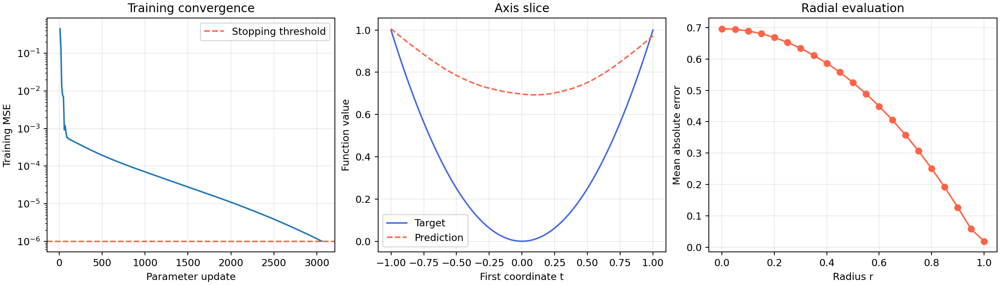

# 高维球中的体积集中与神经网络学习

基于 PyTorch 的数值复现实验：在 100 维单位球内按体积均匀采样，学习 `y = ||x||²`，观察训练误差很小时，球心附近的预测为什么仍然可能很差。

**AI 辅助项目：代码、技术文档和实验整理使用了 OpenAI Codex。职责、验证范围和限制见 [AI 使用说明](AI_USAGE.md)。**

## 实验结果



| 指标 | 参考运行 |
|---|---:|
| 训练 MSE | 9.995774e-7 |
| 球心真实值 | 0 |
| 球心预测值 | 0.696690 |
| 半径 0.5 球面 MAE | 0.525127 |
| 半径 1 球面 MAE | 0.018698 |
| 独立同分布测试集 MSE | 0.000458146 |
| 独立同分布测试集 MAE | 0.016757 |

这些是真实参考运行的输出，不是每台电脑都必须得到的固定数值。训练误差不等于测试误差，本实验也不能证明所有网络都会在内部失败。

## 实验目的与原理

训练数据集中在外侧时，低训练损失是否能保证模型学会整个球内的函数？

半径为 r 的 d 维球占单位球的体积比例是 r^d。所以体积均匀采样满足 P(||X||≤r)=r^d。100 维时，10000 个样本中落入半径 0.9 内的期望数量只有约 0.266。本次实际为 0。

采样先选均匀球面方向，再令半径 R=U^(1/d)，其中 U 在 [0,1) 上均匀。不能把 R 直接设为 U，也不能只采球面。

网络仅接收原始坐标；标签是坐标平方和。测试包含沿第一坐标轴的 500 个点，以及 21 个不同半径上各 1000 个球面点。额外使用独立同分布测试集。

## 快速开始

参考环境为 Python 3.13.9，建议使用 Python 3.13。首次安装需要网络，CPU 即可运行，无需 GPU。

在下载并解压的项目目录中执行：

```powershell
python -m venv .venv
.venv\Scripts\python -m pip install --upgrade pip
.venv\Scripts\python -m pip install torch==2.14.0 --index-url https://download.pytorch.org/whl/cpu
.venv\Scripts\python -m pip install -r requirements.txt
.venv\Scripts\python -m jupyterlab experiment.ipynb
```

macOS/Linux 使用 `.venv/bin/python` 替代 `.venv\Scripts\python`。macOS 可直接通过 `pip install -r requirements.txt` 安装平台适配的 PyTorch；本项目没有在 macOS/Linux 实际执行完整训练。

Notebook 与脚本包含相同的实验流程。脚本执行命令：

```powershell
.venv\Scripts\python experiment.py
```

默认最多训练 6000 次更新；达到训练 MSE<1e-6 后停止。本机参考用时约 159 秒，其他机器耗时会不同。重新运行结果写到 `results/latest/`，保留的参考结果位于 `results/reference/`。

## 文件说明

- `experiment.ipynb`：实验记录，包含方法说明、代码和参考运行输出。
- `experiment.py`：同一算法的可运行脚本，也支持 VS Code 分段执行。
- `results/reference/`：参考指标、训练历史、评估数组与图形。
- `AI_USAGE.md`：AI 使用范围与验证边界。

## 与教材的关系

参考资料：《深度学习导论》，所用 PDF 第 64—65 页，图 2.2。正式书目信息及版次尚待核实；本项目为独立复现实验，非教材官方实现。仓库不再分发教材页面。

书中明确给出：100 维、10000 个训练点、平方和目标、两层 ReLU 网络、训练损失小于 1e-6、轴向及球面测试。

本复刻补充设置：100→512→1，按两个带参数的线性层计算层数；MSE；Adam 初始学习率 0.001；每 10 步检查损失；ReduceLROnPlateau 在损失持续不改善时降低学习率；随机种子 42；CPU 四线程。具体值见 [`results/reference/metrics.json`](results/reference/metrics.json) 与代码。

## 验证与限制

原参考运行已完整执行。公开版本已在参考环境完整重跑，3060 次更新后达到训练阈值；训练和测试指标、评估数组均与原参考运行完全一致。另通过语法、Notebook 格式及采样理论检查。尚未在全新环境或其他操作系统进行完整训练。

当前仅提供一次运行，不提供多随机种子置信区间。普通同分布测试误差也明显高于训练误差，训练误差与泛化误差应分别报告。

## 可复现性

依赖按参考环境固定版本。脚本使用英文绘图标签，避免依赖特定操作系统的中文字体。使用同一 Python 环境安装并运行 JupyterLab、PyTorch；所有输出相对项目目录保存。

尚未达到目标训练损失的运行应保留其实际数值，不能仅凭图形趋势判断复现成功。

参考工具文档：[PyTorch](https://pytorch.org/get-started/locally/)、[JupyterLab](https://jupyterlab.readthedocs.io/en/stable/getting_started/installation.html)。
